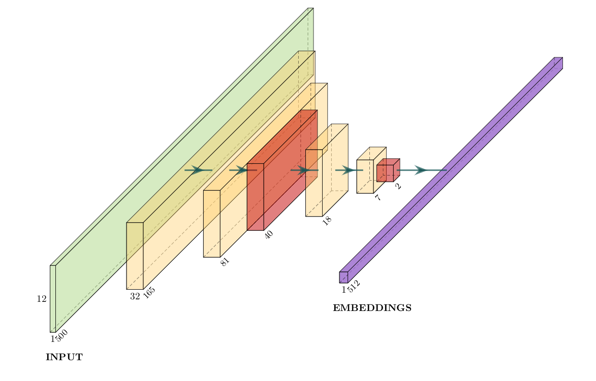

# Cover Song Identification
[](https://mybinder.org/v2/gh/vignejs/cover-song-identification/master) [](https://lbesson.mit-license.org/) 

[](https://deepnote.com/project/82619257-0268-4ccc-bfdb-af99b74ce311)

Cover Song Identification with Siamese Network. Embeddings can be generated with CNN encoder for faster retrieval of similar (cover) songs for a given query song.

## Dataset
Dataset taken from [Da-Tacos](https://github.com/MTG/da-tacos), which consists of subsets i.e benchmark and coveranalysis. Benchmark subset has 15000 songs with 1000 unique works each with 13 performances (2000 songs were added as noise), whereas Coveranalysis subset has 10000 songs with 5000 unique works each with 2 performances. You can find more in their official github [repo](https://github.com/MTG/da-tacos).

## Preprocess

```
➜ python preprocess.py --help
Usage: preprocess.py [OPTIONS] COMMAND [ARGS]...

  script contains two subcommands to either generates a single h5 file from
  audio directory or da-tacos dataset

Options:
  --help  Show this message and exit.

Commands:
  da-tacos         command to downsize the da-tacos dataset, generates a...
  from-audio-dir  command to convert audio files directly to a single h5...

```
### Generating from da-tacos dataset
```
➜ python preprocess.py da-tacos --help
Usage: preprocess.py da-tacos [OPTIONS]

  command to downsize the da-tacos dataset, generates a single h5 file for
  each subset

Options:
  -d, --data-dir PATH             path to datasets folder which contains da-
                                  tacos_benchmark_subset_single_files/ and da-
                                  tacos_coveranalysis_subset_single_files/
                                  folders  [default: datasets]

  -p, --pcp-features [crema|chroma_cens|hpcp]
                                  select pcp feature (use this option multiple
                                  times for more than one selection)
                                  [default: crema]

  -s, --spect-len INTEGER         Resized output spectral length  [default:
                                  500]

  --help                          Show this message and exit.

```
### Generating from an audio directory
```
➜ python preprocess.py from-audio-dir --help
Usage: preprocess.py from-audio-dir [OPTIONS]

  command to convert audio files directly to a single h5 file for testing
  and evaluation.

Options:
  -a, --audio-dir PATH            path to audio folder  [required]
  -o, --output-dir PATH           path to output folder, where the script will
                                  generate an intermediate features folder and
                                  single h5 file from that folder.  [default:
                                  datasets]

  -p, --pcp-features [crema|chroma_cens|hpcp]
                                  select pcp feature (use this option multiple
                                  times for more than one selection)
                                  [default: crema]

  -r, --run-mode [parallel|single]
                                  Whether to run the extractor in single or
                                  parallel mode.  [default: parallel]

  -n, --workers INTEGER           No of workers in parallel mode  [default:
                                  -1]

  -s, --spect-len INTEGER         Resized output spectral length  [default:
                                  500]

  --help                          Show this message and exit.

```

## Training
<a href="https://colab.research.google.com/github/vignejs/cover-song-identification/blob/master/train.ipynb" target="_parent"></a>

The model was trained on crema pcp features from benchmark subset resized to 23x500 by tiling 2 times in pitch dimension and removing the last row as inspired by [[1]](#1). Siamese has two input CNN encoder with shared weights for learning the embeddings for each input audio features. The two input pair being performance from same works as positive class and performance of one of the work and other from randomly chosen work as negative class. The L1 distance of these two encoder is densely connected to one sigmoidal output. Lookahead optimizer in used in conjunction with Adam for better performance. Model was validatde on coveranalysis subset.

|  |
|:--:| 
|*a single CNN encoder*|

## Evaluation
<a href="https://colab.research.google.com/github/vignejs/cover-song-identification/blob/master/evaluate.ipynb" target="_parent"></a>

Model was evaluated on a small dataset from youtube. You can get the pretrained weights and testset for evaluation from [here](https://github.com/vignejs/cover-song-identification/releases/tag/v0.1.0).

## References
<a id="1">[1]</a>
Yesiler, Furkan, Joan Serra, and Emilia Gomez. “Accurate and Scalable Version Identification Using Musically-Motivated Embeddings.” ICASSP 2020 - 2020 IEEE International Conference on Acoustics, Speech and Signal Processing (ICASSP) (2020): n. pag. Crossref. Web.

## Issues
If you face any problem file an issue. Pull requests are welcome.

## License
[MIT](LICENSE)