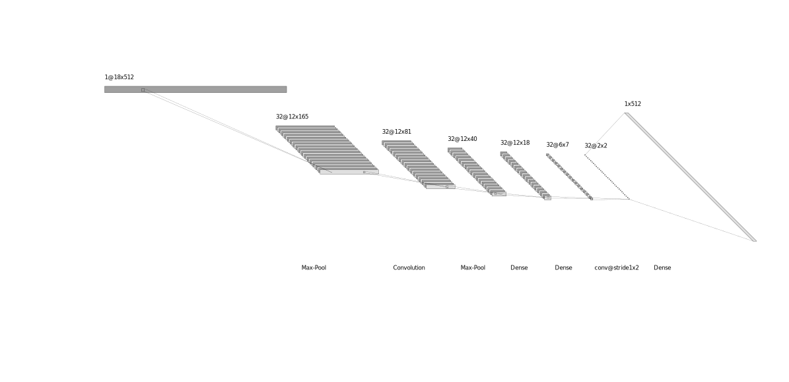

# Cover Song Identification
Cover Song Identification with Siamese Network. Embeddings can be generated with CNN encoder for faster retrieval of similar (cover) songs for a given query song.

## Dataset
Dataset taken from [Da-Tacos](https://github.com/MTG/da-tacos), which consists of subsets i.e benchmark and coveranalysis. Benchmark subset has 15000 songs with 1000 unique works each with 13 performances (2000 songs were added as noise), whereas Coveranalysis subset has 10000 songs with 5000 unique works each 2 performances. You can find more in their official github [repo](https://github.com/MTG/da-tacos).

## Network
